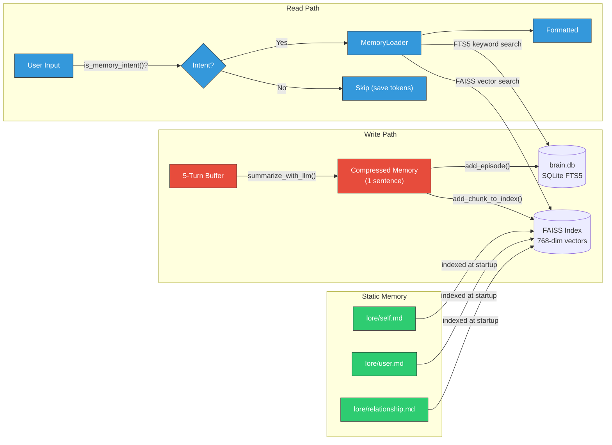
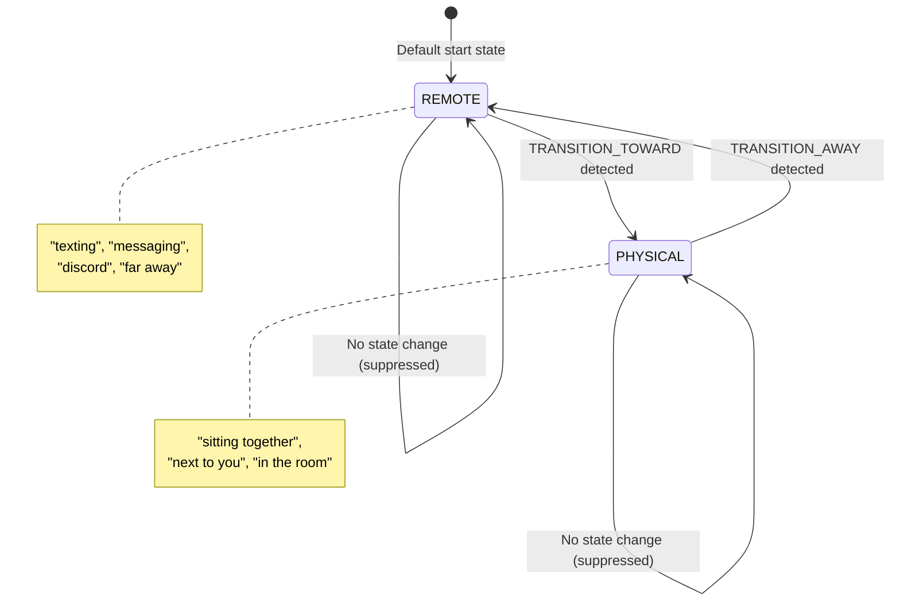
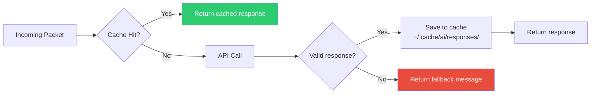
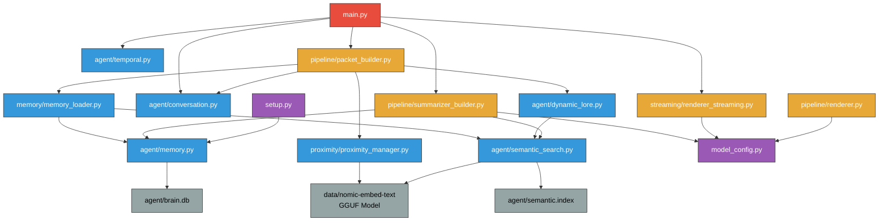

# 🏗️ High-Level Design (HLD) — Persistent Character Agent

> **Persistent Character Agent with Memory, Identity, and Time Awareness**
> Powered by Google Gemini API (gemma-3-12b-it) | Technical Documentation for Portfolio & Code Review

---

## 1. System Overview

A **stateful conversational AI agent** that maintains persistent memory, personality (lore), temporal awareness, and spatial proximity detection across sessions. Unlike stateless chatbots, this agent remembers past conversations, understands time gaps, and adapts behavior based on physical/emotional proximity — creating a deeply personalized experience.

### Key Design Principles

| Principle | Description |
|---|---|
| **Hold-Wait-Commit** | Don't log user input until AI responds successfully — ensures clean conversation history |
| **Token Economy** | Only inject memory/proximity context when needed — saves API tokens |
| **Dual Memory** | Episodic (SQLite FTS5) + Semantic (FAISS vectors) for keyword and meaning-based recall |
| **Cycle-Based Compression** | Every 5 turns → LLM summarizes → indexes to permanent storage |

---

## 2. System Architecture Diagram

```mermaid
graph TB
    subgraph User Layer
        UI["🖥️ CLI Interface<br/>main.py"]
    end

    subgraph Orchestration Layer
        TC["🚦 Traffic Control<br/>Hold-Wait-Commit"]
        TM["⏰ TimeManager<br/>agent/temporal.py"]
        PB["📦 PacketBuilder<br/>pipeline/packet_builder.py"]
    end

    subgraph Context Enrichment
        DL["📜 Dynamic Lore<br/>agent/dynamic_lore.py"]
        ML["🧠 Memory Loader<br/>memory/memory_loader.py"]
        PM["📍 Proximity Manager<br/>proximity/proximity_manager.py"]
        CH["💬 Conversation History<br/>agent/conversation.py"]
    end

    subgraph Inference Layer
        SR["🌊 Streaming Renderer<br/>streaming/renderer_streaming.py"]
        R["⚙️ Renderer (Sync)<br/>pipeline/renderer.py"]
        API["☁️ Google Gemini API<br/>gemma-3-12b-it"]
    end

    subgraph Memory Pipeline
        SB["🗜️ Summarizer Builder<br/>pipeline/summarizer_builder.py"]
        MS["💾 MemoryStore<br/>agent/memory.py → brain.db"]
        SS["🔍 SemanticSearch<br/>agent/semantic_search.py"]
    end

    subgraph Storage Layer
        DB[("🗄️ brain.db<br/>SQLite FTS5")]
        FI[("📊 semantic.index<br/>FAISS")]
        CJ[("📋 semantic_chunks.json")]
        LF["📁 Lore Files<br/>self.md / user.md / relationship.md"]
        LG["📝 Session Logs<br/>convo_*.txt"]
        TS["🕐 timestamps.json"]
        CACHE["💨 Response Cache<br/>~/.cache/ai/"]
        GGUF["🧠 nomic-embed-text<br/>v1.5 Q8_0 GGUF"]
    end

    %% Main Flow
    UI -->|"1. User Input"| TC
    TC -->|"2. HOLD input"| TM
    TM -->|"3. Time delta"| PB
    PB -->|"4. Enrich"| DL
    PB -->|"4. Enrich"| ML
    PB -->|"4. Enrich"| PM
    PB -->|"4. Enrich"| CH
    PB -->|"5. XML Packet"| SR
    SR -->|"6. HTTP POST"| API
    API -->|"7. Streamed chunks"| SR
    SR -->|"8. Cleaned response"| TC
    TC -->|"9. COMMIT"| CH

    %% Summarizer Pipeline
    TC -->|"10. Every 5 turns"| SB
    SB -->|"Summarize"| API
    SB -->|"Index episodic"| MS
    SB -->|"Index semantic"| SS

    %% Storage connections
    MS --- DB
    SS --- FI
    SS --- CJ
    DL -.->|"search"| SS
    ML -.->|"semantic search"| SS
    ML -.->|"keyword search"| MS
    PM -.->|"embeddings"| GGUF
    SS -.->|"embeddings"| GGUF
    CH --- LG
    TM --- TS
    R -.->|"cache lookup"| CACHE
    DL -.->|"lore chunks"| LF

    %% Styling
    classDef user fill:#4a90d9,stroke:#333,color:#fff
    classDef orch fill:#e8a838,stroke:#333,color:#fff
    classDef context fill:#50c878,stroke:#333,color:#fff
    classDef inference fill:#ff6b6b,stroke:#333,color:#fff
    classDef memory fill:#9b59b6,stroke:#333,color:#fff
    classDef storage fill:#95a5a6,stroke:#333,color:#000

    class UI user
    class TC,TM,PB orch
    class DL,ML,PM,CH context
    class SR,R,API inference
    class SB,MS,SS memory
    class DB,FI,CJ,LF,LG,TS,CACHE,GGUF storage
```



---

## 3. Component Deep-Dive

### 3.1 Entry Point — `main.py`

The **control loop** that orchestrates the entire system. Think of it as **Traffic Control**.

```
┌─────────────────────────────────────────────────────────┐
│  main.py — The Control Loop                             │
│                                                         │
│  1. start_new_session()     → Create convo_*.txt file   │
│  2. Initialize TimeManager + PacketBuilder              │
│  3. while True:                                         │
│     ├── input() → user_input                            │
│     ├── HOLD (don't log yet)                            │
│     ├── timer.load_and_update()                         │
│     ├── builder.build(input, time_block)                │
│     ├── render_streaming(packet)                        │
│     ├── is_valid_response()?                            │
│     │   ├── YES → COMMIT (log both messages)            │
│     │   └── NO  → DISCARD (nothing saved)               │
│     └── turn == 5? → run_summarizer_pipeline()          │
└─────────────────────────────────────────────────────────┘
```

> [!IMPORTANT]
> **Why Hold-Wait-Commit?** If the AI fails (timeout, bad response), nothing gets logged. The conversation history stays clean. The user can retry without "polluting" the log.

---

### 3.2 Agent Module — `agent/`

| File | Class/Function | Purpose |
|---|---|---|
| `temporal.py` | `TimeManager` | Computes time since last interaction (`Δ = 5.3 hours`) |
| `memory.py` | `MemoryStore` | SQLite FTS5 wrapper for episodic memory (keyword search) |
| `semantic_search.py` | `SemanticSearch` | FAISS vector index for semantic similarity search |
| `conversation.py` | `log_message`, `buffer_*` | Session logging + in-memory buffer for 5-turn cycles |
| `dynamic_lore.py` | `get_dynamic_lore` | Retrieves relevant lore chunks via semantic search |

---

### 3.3 Pipeline Module — `pipeline/`

| File | Purpose |
|---|---|
| `packet_builder.py` | Assembles the **XML-tagged prompt** with all context injections |
| `renderer.py` | Non-streaming Gemini API call (with caching + retries) |
| `summarizer_builder.py` | 5-turn compression + dual-index storage (Stage 2 & 3) |

> [!NOTE]
> `renderer.py` currently contains shared utilities (parsing, cleaning, validation) that are duplicated in `renderer_streaming.py`. See LLD Section 4 for a proposed SOLID refactoring to extract these into a shared `renderer_base.py` module.

---

### 3.4 External Modules

| Module | File | Purpose |
|---|---|---|
| `streaming/` | `renderer_streaming.py` | Real-time streaming with typewriter effect (15ms/char) |
| `proximity/` | `proximity_manager.py` | Detects PHYSICAL / REMOTE / TRANSITION states via embeddings |
| `memory/` | `memory_loader.py` | Intent detection ("do you remember...") + memory fetching |

---

## 4. Data Flow — Step by Step

```mermaid
sequenceDiagram
    participant U as 👤 User
    participant M as main.py
    participant T as TimeManager
    participant PB as PacketBuilder
    participant DL as DynamicLore
    participant PM as ProximityMgr
    participant ML as MemoryLoader
    participant CH as Conversation
    participant SR as StreamRenderer
    participant API as Gemini API
    participant SUM as Summarizer
    participant DB as brain.db
    participant FX as FAISS Index

    U->>M: "Do you remember our trip?"
    Note over M: HOLD — input NOT logged yet

    M->>T: load_and_update()
    T-->>M: time_block (Δ = 3.2 hours)

    M->>PB: build(user_input, time_block)
    
    par Context Enrichment (Parallel Conceptually)
        PB->>DL: get_dynamic_lore(input, k=4)
        DL->>FX: search(input) → filter lore/* sources
        FX-->>DL: Top 4 lore chunks
        DL-->>PB: Relevant personality data

        PB->>PM: detect_state(input, history)
        PM-->>PB: get_proximity_block() → <distance_context>

        PB->>ML: get_memory_section(input)
        Note over ML: "remember" keyword detected ✅
        ML->>DB: FTS5 search (episodic)
        ML->>FX: vector search (semantic)
        ML-->>PB: <memory_bank>...</memory_bank>

        PB->>CH: get_recent_history(limit=10)
        CH-->>PB: Last 6 turns
    end

    PB-->>M: XML Packet (complete prompt)

    M->>SR: render_streaming(packet)
    SR->>API: POST streamGenerateContent
    API-->>SR: Streamed JSON chunks

    Note over SR: Typewriter effect (15ms/char)
    SR-->>M: cleaned response

    alt Valid Response
        M->>CH: log_message("user", input)
        M->>CH: log_message("assistant", response)
        Note over M: COMMIT ✅ — Turn Counter++
    else Invalid Response
        Note over M: DISCARD ❌ — Nothing saved
    end

    opt Turn Counter == 5
        M->>SUM: run_summarizer_pipeline(buffer)
        SUM->>API: Summarize 5 turns → 1 sentence
        API-->>SUM: Compressed memory sentence
        SUM->>DB: add_episode(compressed_memory)
        SUM->>FX: add_chunk_to_index(compressed_memory)
        Note over M: Buffer cleared, cycle reset
    end
```



---

## 5. Packet Format (The Prompt Structure)

Every user message is wrapped in an **XML-tagged prompt** before being sent to Gemini:

```xml
<system_directive>
  Roleplay as the AI character.
  <assistant_persona>
    Name: [Character] | Relationship: [Context]
    Identity: [Background] | Background: [Details]
  </assistant_persona>
  <lore>
    - [Dynamically retrieved personality chunks]
  </lore>
</system_directive>

<temporal_data>
  Current Date: 2026-02-10 11:00
  Time since last chat: 3.2 hours
</temporal_data>

<distance_context>                    ← CONDITIONAL (only on change)
  The AI is physically present.
</distance_context>

<memory_bank>                         ← CONDITIONAL (only on intent)
  Use from this memory block only if required.
  - User recalled visiting the park last week...
  - AI mentioned wanting to do an activity together...
</memory_bank>

<chat_history>
  Last 5 conversation turns
  [User]: Do you remember our trip?
  [AI]: Of course! The lake was beautiful...
</chat_history>

<user_input>
  Do you remember our trip?
</user_input>

<trigger>
  Start with [AI]: then your dialogue.
</trigger>
```

> [!TIP]
> **Token Economy**: `<distance_context>` and `<memory_bank>` are **conditional blocks**. They only appear when proximity changes or memory intent is detected. This saves ~200-500 tokens per turn.

---

## 6. Memory Architecture



### Dual Memory System — Why?

| Aspect | Episodic (SQLite FTS5) | Semantic (FAISS) |
|---|---|---|
| **Search Type** | Keyword-based | Meaning-based |
| **Strengths** | Exact word matches ("park", "college") | Understands synonyms & concepts |
| **Use Case** | "What did we talk about?" | "Tell me about our adventures" |
| **Top K** | 3 results | 5 results |
| **Embedding** | N/A | nomic-embed-text-v1.5 (768-dim) |

---

## 7. Proximity Detection System



**How it works:**
1. User input is embedded using the **nomic-embed-text** model
2. Cosine similarity computed against 4 pre-computed **anchor vectors** (PHYSICAL, REMOTE, TRANSITION_AWAY, TRANSITION_TOWARD)
3. If confidence > **0.45** and state differs from current → **state change triggered**
4. Transition states map to final states: `TOWARD → PHYSICAL`, `AWAY → REMOTE`
5. **Injection logic**: Only inject `<distance_context>` on first turn or state change

---

## 8. Caching Strategy



- **Cache key**: MD5 hash of `(system_instruction + user_content)`
- **Location**: `~/.cache/ai/responses/{hash}.json`
- **Purpose**: Deduplication — identical prompts return cached results

---

## 9. Error Handling & Resilience

| Scenario | Handling |
|---|---|
| **API timeout** | Retry up to 3 times with exponential backoff (0.5s × attempt) |
| **Empty response** | Retry, then return fallback message |
| **User impersonation** | Response starting with `[User]:` is rejected |
| **Invalid response** | DISCARD — nothing logged, user can retry |
| **No API key** | Graceful error message, fallback returned |
| **FAISS unavailable** | Falls back to numpy brute-force cosine similarity |
| **Model file missing** | Falls back to zero vectors or random vectors |

---

## 10. Technology Stack

| Component | Technology |
|---|---|
| **Language** | Python 3.10+ |
| **LLM** | Google Gemini API — gemma-3-12b-it |
| **Embeddings** | nomic-embed-text-v1.5.Q8_0 (GGUF format, llama-cpp-python) |
| **Vector Index** | FAISS IndexFlatIP (cosine similarity via inner product) |
| **Database** | SQLite with FTS5 (full-text search) |
| **HTTP Client** | requests library |
| **CLI** | Built-in Python `input()` |
| **Streaming** | Gemini `streamGenerateContent` endpoint |

---

## 11. Scalability & Bottleneck Analysis

> [!WARNING]
> This section identifies current bottlenecks — relevant for system design discussions.

| Bottleneck | Current State | Mitigation Path |
|---|---|---|
| **Single-threaded** | CLI loop blocks on API call | Async I/O (`asyncio + aiohttp`) |
| **In-memory buffer** | Lost on crash | Persist buffer to disk periodically (`buffer_save_to_file()` exists but unused) |
| **FAISS flat index** | O(n) search | FAISS IVF or HNSW for > 10K chunks |
| **No auth** | API key in plaintext file | Environment variables or secret manager |
| **Singleton embedding model** | Loaded twice (SemanticSearch + ProximityManager) | Share single model instance |
| **No rate limiting** | Could hit API quota | Token bucket or sliding window |
| **Session file I/O** | Append per message | Batch writes or in-memory buffer flush |

---

## 12. File Dependency Graph



---

## 13. Design Patterns Used

| Pattern | Where | Why |
|---|---|---|
| **Singleton** | `SemanticSearch._search_instance` | Avoid reloading 140MB embedding model |
| **Builder** | `PacketBuilder.build()` | Assemble complex XML prompt from parts |
| **Strategy** | Streaming vs Non-streaming renderer | Same interface, different execution |
| **Observer-like** | Proximity state change detection | Only inject context on state transitions |
| **Template Method** | `build_summarizer_packet()` | Fixed structure, variable content |
| **Lazy Loading** | `_get_llama()` with global cache | Defer expensive model load until first use |

---

## 14. Glossary

| Term | Definition |
|---|---|
| **Packet** | The complete XML-tagged prompt sent to the Gemini API |
| **Turn** | One user message + one AI response |
| **Cycle** | 5 turns — triggers summarization pipeline |
| **Compressed Memory** | A 1-sentence LLM-generated summary of 5 turns |
| **Lore** | Static personality files that define the character |
| **Dynamic Lore** | Semantically retrieved lore chunks relevant to current input |
| **Proximity State** | PHYSICAL / REMOTE — detected from user input via embeddings |
| **Brain.db** | SQLite database storing all episodic memories |
| **FAISS Index** | Vector similarity index for semantic memory retrieval |
| **Traffic Control** | The Hold-Wait-Commit pattern for safe conversation logging |

---

> *Persistent Character Agent — Technical HLD | Python + Gemini API + FAISS + SQLite*
