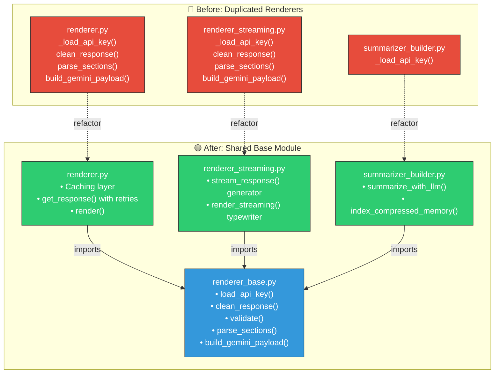
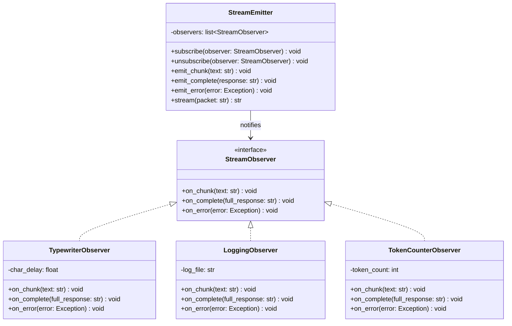
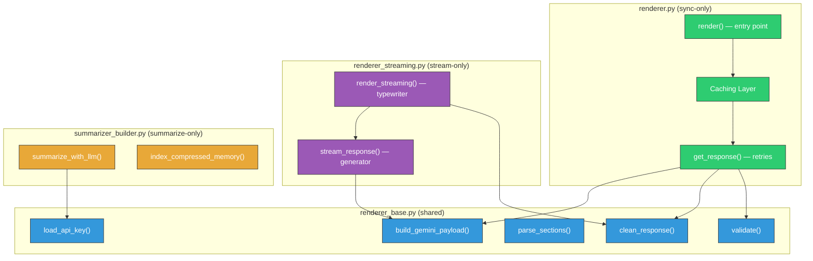

# 🔬 Low-Level Design (LLD) — Persistent Character Agent

> Core Classes, Methods, Design Patterns, and SOLID Analysis
> Technical Documentation for Portfolio & Code Review

---

## 1. Class Inventory & Relationships

```mermaid
classDiagram
    direction TB

    class TimeManager {
        -now: datetime
        -last_interaction: datetime
        -delta_str: str
        +load_and_update() void
        +get_time_block() str
    }

    class MemoryStore {
        -conn: sqlite3.Connection
        +_init_db() void
        +load_from_txt(filepath: str) int
        +search(query: str, limit: int) list~str~
        +add_episode(content: str, source: str) int
        +wipe_memory() void
        +close() void
    }

    class SemanticSearch {
        -encoder: Llama
        -index: faiss.IndexFlatIP
        -chunks: list~tuple~
        -dimension: int = 768
        -model_path: str
        -_load_encoder() void
        -_embed(texts: list) ndarray
        -_load_or_build_index() void
        -_collect_all_chunks() list~tuple~
        +build_index() void
        +search(query: str, k: int) list~tuple~
    }

    class PacketBuilder {
        -memory_loader: MemoryLoader
        -proximity_manager: ProximityManager
        -turn_count: int
        +build(user_input: str, time_block: str) str
    }

    class MemoryLoader {
        -memory_store: MemoryStore
        +is_memory_intent(user_input: str) bool$
        +format_memories(memories: list, max_length: int) str$
        +fetch_memories(user_input: str) str
        +get_memory_section(user_input: str) str
        +close() void
    }

    class ProximityManager {
        -embed_model: Llama
        -anchor_vectors: dict
        -current_state: str
        -last_injected_state: str
        -anchors: dict
        -_load_model() void
        -_embed(text: str) ndarray
        -_precompute_anchors() void
        +detect_state(user_input: str, history: str) tuple
        +get_proximity_block(is_first_turn: bool) str
        +get_current_state() str
    }

    class ConversationModule {
        <<module>>
        -_current_session_file: str
        -_buffer: list~dict~
        +start_new_session() void
        +log_message(role: str, content: str) void
        +get_recent_history(hours: int, limit: int) list~tuple~
        +buffer_add(role: str, content: str) void
        +buffer_get() list~dict~
        +buffer_clear() void
        +buffer_to_raw_text() str
        +buffer_save_to_file() str
        +get_current_session_file() str
    }

    class DynamicLoreModule {
        <<module>>
        +get_dynamic_lore(user_input: str, k: int) str
    }

    class Renderer {
        <<module>>
        +render(packet: str) str
        +get_response(system: str, contents: list) str
        +build_gemini_payload(packet: str) tuple
        +parse_sections(packet: str) dict
        +clean_response(content: str) str
        +validate(content: str) tuple
        -get_cached_response() str
        -save_cached_response() void
        -clear_cache() void
    }

    class StreamingRenderer {
        <<module>>
        +render_streaming(packet: str, char_delay: float) str
        +stream_response(packet: str) Generator
        +build_gemini_payload(packet: str) tuple
        +parse_sections(packet: str) dict
        +clean_response(content: str) str
    }

    class SummarizerBuilder {
        <<module>>
        +run_summarizer_pipeline(raw: str, cycle_num: int) str
        +build_summarizer_packet(raw: str) str
        +save_summarizer_packet(packet: str) void
        +summarize_with_llm(raw: str) str
        +index_compressed_memory(mem: str, cycle: int) dict
    }

    %% Relationships
    PacketBuilder --> MemoryLoader : uses
    PacketBuilder --> ProximityManager : uses
    PacketBuilder --> ConversationModule : reads history
    PacketBuilder --> DynamicLoreModule : retrieves lore

    MemoryLoader --> MemoryStore : keyword search
    MemoryLoader --> SemanticSearch : vector search

    DynamicLoreModule --> SemanticSearch : search + filter lore/*

    SummarizerBuilder --> MemoryStore : add_episode()
    SummarizerBuilder --> SemanticSearch : add_chunk_to_index()

    Renderer ..> StreamingRenderer : same interface, different strategy

    note for Renderer "⚠️ Code duplication with StreamingRenderer:<br/>parse_sections, build_gemini_payload,<br/>clean_response, _load_api_key"
```



---

## 2. Method Signature Reference

### 2.1 Orchestration (`main.py`)

| Function | Signature | Purpose |
|---|---|---|
| `is_valid_response` | `(response: str) → bool` | Guard: rejects fallback/error/empty responses |
| `main` | `() → void` | CLI loop with Hold-Wait-Commit traffic control |

### 2.2 Agent Module

| Class | Method | Signature | Complexity |
|---|---|---|---|
| `TimeManager` | `load_and_update` | `() → void` | Reads/writes `timestamps.json`, computes delta |
| `TimeManager` | `get_time_block` | `() → str` | Formats time info for packet |
| `MemoryStore` | `search` | `(query: str, limit=3) → list[str]` | FTS5 search with stop-word filtering |
| `MemoryStore` | `add_episode` | `(content: str, source: str) → int` | Stage 3 memory burn |
| `MemoryStore` | `load_from_txt` | `(filepath: str) → int` | Ingests text file chunks into FTS5 |
| `MemoryStore` | `wipe_memory` | `() → void` | Clears all episodes from database |
| `SemanticSearch` | `search` | `(query: str, k=5) → list[tuple]` | FAISS cosine similarity, returns `(source, text, score)` |
| `SemanticSearch` | `build_index` | `() → void` | Indexes lore + episodes + semantic memory |
| `add_chunk_to_index` | — | `(text: str, source: str) → bool` | Stage 3: real-time index append after summarization |
| `rebuild_index` | — | `() → void` | Rebuilds entire FAISS index from scratch |
| `get_dynamic_lore` | — | `(user_input: str, k=4) → str` | Searches index, filters `lore/*` sources only |

### 2.3 Pipeline Module

| Function | Signature | Purpose |
|---|---|---|
| `PacketBuilder.build` | `(user_input: str, time_block: str) → str` | Assembles full XML packet |
| **renderer.py** | | |
| `render` | `(packet: str) → str` | Non-streaming API call with cache |
| `get_response` | `(system: str, contents: list) → str` | API call with retries + exponential backoff |
| `build_gemini_payload` | `(packet: str) → (str, list)` | Constructs Gemini API request payload |
| `parse_sections` | `(packet: str) → dict` | Extracts XML-tagged sections from packet |
| `clean_response` | `(content: str) → str` | Strips prefixes and artifacts from response |
| `validate` | `(content: str) → (bool, str)` | Checks response is safe and valid |
| **renderer_streaming.py** | | |
| `render_streaming` | `(packet: str, char_delay=0.02) → str` | Streaming with typewriter effect |
| `stream_response` | `(packet: str) → Generator` | Yields chunks as they arrive from API |
| **summarizer_builder.py** | | |
| `run_summarizer_pipeline` | `(raw: str, cycle_num=0) → str` | Stage 2+3: summarize + index |
| `summarize_with_llm` | `(raw: str) → str` | Compresses 5 turns into 1 sentence |
| `index_compressed_memory` | `(mem: str, cycle: int) → dict` | Burns compressed memory to both stores |

### 2.4 Context Modules

| Class | Method | Signature | Purpose |
|---|---|---|---|
| `MemoryLoader` | `is_memory_intent` | `(input: str) → bool` | Regex keyword detection (static) |
| `MemoryLoader` | `format_memories` | `(memories: list, max_length=150) → str` | Format memory strings as bullet points (static) |
| `MemoryLoader` | `fetch_memories` | `(input: str) → str` | Fetch from both episodic + semantic sources |
| `MemoryLoader` | `get_memory_section` | `(input: str) → str` | Returns `<memory_bank>` XML or `""` |
| `ProximityManager` | `detect_state` | `(input: str, history: str) → (str, bool)` | Embedding-based state classification |
| `ProximityManager` | `get_proximity_block` | `(is_first: bool) → str` | Returns `<distance_context>` XML or `""` |
| `ProximityManager` | `get_current_state` | `() → str` | Returns current proximity state string |

---

## 3. Design Patterns — Before vs Now

### 3.1 Currently Used

| Pattern | Where | Assessment |
|---|---|---|
| **Singleton** | `SemanticSearch` via `_search_instance` | ✅ Good — avoids 140MB model reload |
| **Builder** | `PacketBuilder.build()` | ✅ Good — assembles complex XML prompt |
| **Lazy Initialization** | `_get_llama()` global function | ✅ Good — defers expensive model load |
| **Template Method** | `build_summarizer_packet()` | ✅ Good — fixed structure, variable data |

### 3.2 Proposed Refactoring (Before → Now)



| # | Pattern | Applied Here | Benefit |
|---|---|---|---|
| 1 | **Strategy** | Swap `SyncRenderer` / `StreamingRenderer` via common interface | Eliminates code duplication |
| 2 | **Observer** | `stream_response()` emits events on chunk arrival | Decouples streaming from display logic |
| 3 | **Factory Method** | `create_renderer(streaming=True)` | Centralizes renderer instantiation |
| 4 | **Repository** | Unified `MemoryRepository` over both stores | Single query interface regardless of backend |
| 5 | **Chain of Responsibility** | Clean → Validate → Cache pipeline | Each step is independently extensible |

### 3.3 Observer Pattern for LLM Streams (Proposed)



**Example usage:**
```python
emitter = StreamEmitter()
emitter.subscribe(TypewriterObserver(char_delay=0.015))
emitter.subscribe(LoggingObserver("stream.log"))
emitter.subscribe(TokenCounterObserver())

response = emitter.stream(packet)
# All observers notified automatically as chunks arrive
```

---

## 4. SOLID Analysis

### 4.1 Current Violations

| Principle | Violation | File(s) | Severity |
|---|---|---|---|
| **S** — Single Responsibility | `renderer.py` handles parsing, API calls, caching, cleaning, and validation — 5 responsibilities | `renderer.py` | 🔴 High |
| **O** — Open/Closed | Cannot add a new rendering mode without copy-pasting shared functions | `renderer.py`, `renderer_streaming.py` | 🔴 High |
| **L** — Liskov Substitution | N/A — no class hierarchy | — | ⚪ N/A |
| **I** — Interface Segregation | N/A — no interfaces defined | — | ⚪ N/A |
| **D** — Dependency Inversion | `_load_api_key()` directly reads files; modules depend on concrete I/O | All renderers | 🟡 Medium |
| **DRY** | 4 functions duplicated across 3 files (~120 lines) | `renderer.py`, `renderer_streaming.py`, `summarizer_builder.py` | 🔴 High |

### 4.2 Proposed Refactored Architecture



| Principle | After Refactoring | How |
|---|---|---|
| **S** | ✅ Fixed | Each module has one reason to change |
| **O** | ✅ Fixed | New renderer = new file importing `renderer_base` |
| **D** | 🟡 Improved | `load_api_key()` centralized, single source of truth |
| **DRY** | ✅ Fixed | Zero duplication — shared code in one place |

### 4.3 Refactoring Details

| Function | Currently Duplicated In | Proposed Location |
|---|---|---|
| `_load_api_key()` | `renderer.py`, `renderer_streaming.py`, `summarizer_builder.py` | `renderer_base.py` |
| `clean_response()` | `renderer.py`, `renderer_streaming.py` | `renderer_base.py` |
| `validate()` | `renderer.py` | `renderer_base.py` |
| `parse_sections()` | `renderer.py`, `renderer_streaming.py` | `renderer_base.py` |
| `build_gemini_payload()` | `renderer.py`, `renderer_streaming.py` | `renderer_base.py` |

**Impact**: ~120 lines of duplication eliminated. Each module retains only its unique responsibility.

---

## 5. Glossary

| Term | Definition |
|---|---|
| **SRP** | Single Responsibility Principle — a class should have one reason to change |
| **OCP** | Open/Closed Principle — open for extension, closed for modification |
| **DIP** | Dependency Inversion Principle — depend on abstractions, not concretions |
| **DRY** | Don't Repeat Yourself — every piece of knowledge has a single representation |
| **Strategy** | Define a family of algorithms, encapsulate each, make them interchangeable |
| **Observer** | One-to-many dependency — when one object changes state, all dependents are notified |
| **Factory Method** | Define an interface for object creation, let subclasses decide the concrete class |
| **FTS5** | SQLite Full-Text Search extension version 5 |
| **FAISS** | Facebook AI Similarity Search — vector similarity library |
| **GGUF** | GPT-Generated Unified Format — quantized model file format |

---

> *Persistent Character Agent — Technical LLD | Python + Gemini API + FAISS + SQLite*
